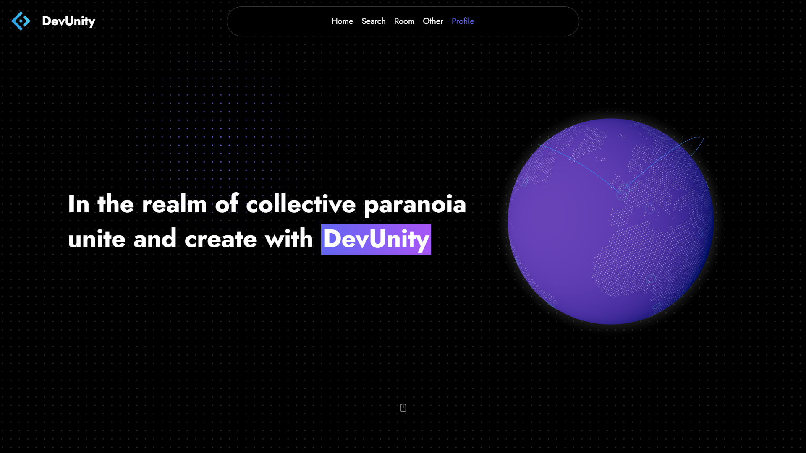
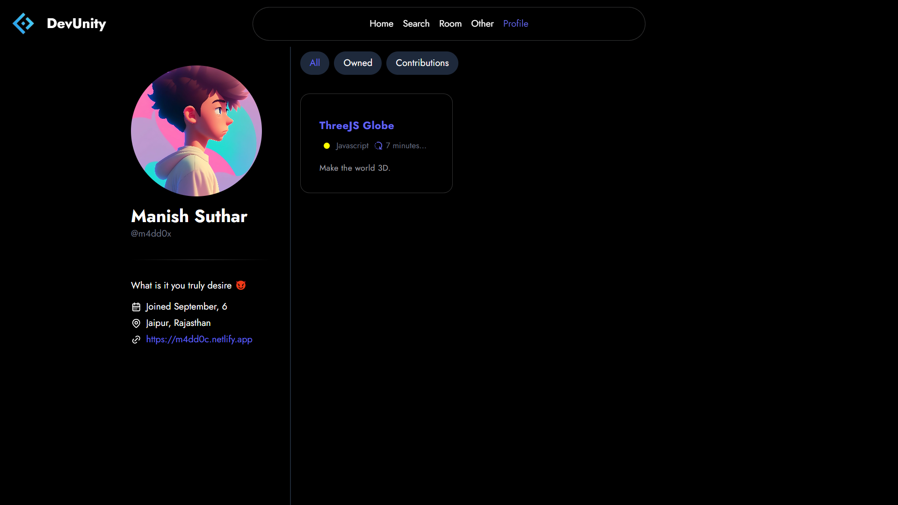
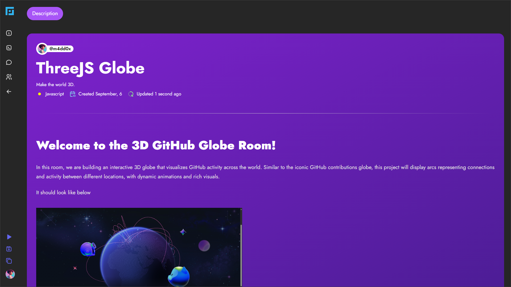
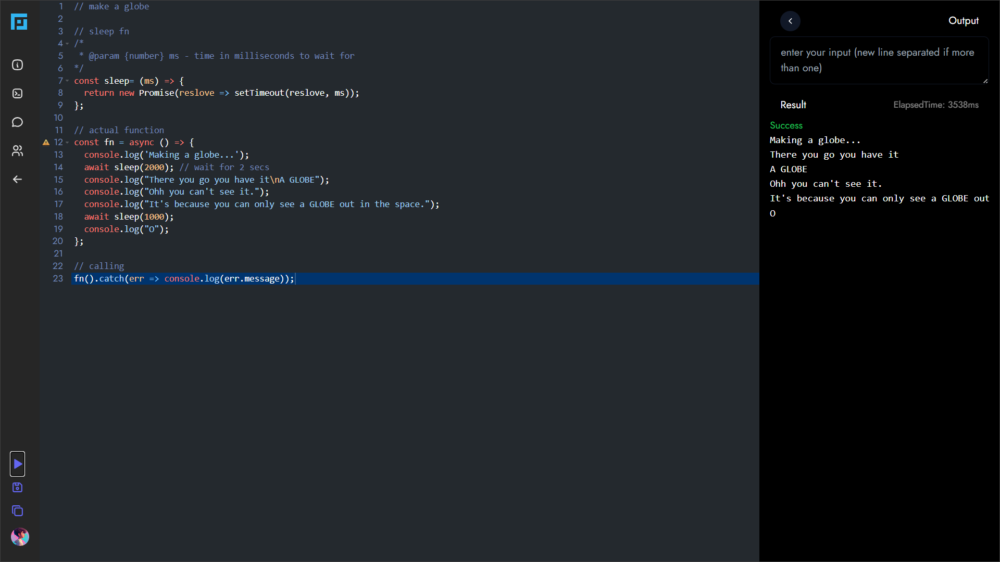

# DevUnity

A Collaboration focused coding platform.

## Table of content

- [DevUnity](#devunity)
  - [Table of content](#table-of-content)
  - [Preview](#preview)
  - [About](#about)
  - [Features](#features)
  - [Bug report or Feature request](#bug-report-or-feature-request)
  - [Want to Contribute?](#want-to-contribute)
  - [Credits](#credits)

## Preview

https://github.com/user-attachments/assets/544e9db6-c54b-42d8-a041-d2a368797d66.mp4

 

## About

DevUnity is a real-time code editing platform [DevUnity](https://www.devunity.netlify.app). It features collaborative chatting, an account system to save your rooms and collaborations, and room-configurable features such as edit description, title, language, password, and more. DevUnity attempts to emulate a natural collaborative experience during a project creation and problem-solving by providing real-time feedback on typing.

## Features

- Real-time Code Editing
- Real-time Chatting with collaborators
- Nice Animated UI
- Abstracted room preview as well as password protections
- Better Description with TinyMCE
- Live diagnosis, syntax highlighting, and useful key-mappings
- Ability to run code
- Search users and rooms
- and much more

## Bug report or Feature request

If you encounter a bug or have a feature request,
[send me an email](mailto:m4dd0x078@gmail.com),
[create an issue](https://github.com/m4dd0c/DevUnity/issues),
[create a discussion thread](https://github.com/m4dd0c/DevUnity/discussions)

## Want to Contribute?

Refer to [CONTRIBUTING.md](./CONTRIBUTING.md).

## Credits

[Aceternity](https://ui.aceternity.com) for amazing UI components.  
[Nitesh Suthar](https://github.com/nitesh098suthar) for the name suggestion.

<!--
All of the [contributors](https://github.com/m4dd0c/DevUnity/graphs/contributors) have helped implement various features, add themes, fix bugs, and more.
-->
